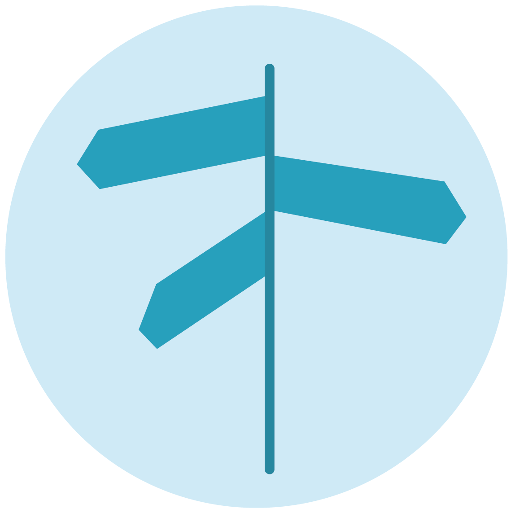
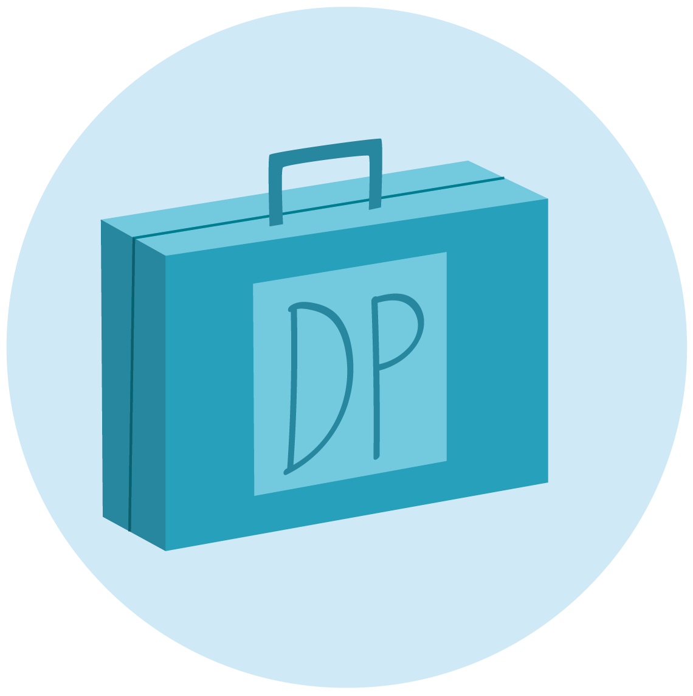

```{warning} Steady Now!
:class: dropdown
:open:
This is an experiment in using a [text-based publication system called MystMD](https://mystmd.org/) as a way of managing and publishing formal {term}`DPC` publications. It currently reflects the structure of [this section of the current website](https://www.dpconline.org/digipres), but with just a small selection of content migrated over.  More details of how this all works can be found in [the project README file](https://github.com/Digital-Preservation-Coalition/digipres-publications?tab=readme-ov-file#digipres-publications).  
```

:::{card}
:header: What is Digital Preservation?
:link: what-is-digipres
Definitions and explanations for anyone new to digital preservation who would like to take practical steps forward in sustaining their digital assets.
:::

:::{card}
:header: Discover Good Practice
:link: ./discover
<div style="float: left; width: 100px; padding: 0.5em;"></div>
Discover authoritative guidance and good practice in digital preservation.
:::

:::{card}
:header: Implement Digital Preservation
:link: ./implement
<div style="float: left; width: 100px; padding: 0.4em;"></div>
Tackle digital preservation challenges with our tools for maturity modelling, policy development, advocacy and procurement.
:::

:::{card}
:header: Champion Digital Preservation
:link: ./champion
<div style="float: left; width: 100px; padding: 0.5em;"></div>
Raise the profile of digital preservation internationally and celebrate the successful work of our members in this field.
:::
