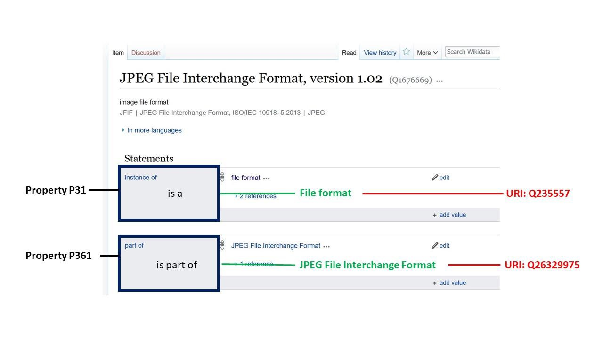

Veille technologique de

DPC, Note d\'orientation

Décembre 2021

© Digital Preservation Coalition 2021 et Ketherine Thornton 2021  
ISSN : 2048-7916  
Tous droits réservés. Aucune partie de cette publication ne peut être reproduite, stockée dans un système d\'extraction, ou transmise, sous quelque forme ou par quelque moyen que ce soit, sans l'autorisation préalable et écrite de l'éditeur. Les droits moraux de l'auteur ont été revendiqués.  
Publié pour la première fois en Grande-Bretagne en 2021 par la Digital Preservation Coalition.

# Informations sur la traduction française

La traduction française de cette note d'orientation a été réalisée dans le cadre des travaux de la Cellule nationale de veille sur les formats. Lancée en 2019, la Cellule nationale de veille sur les formats (CNVF), sous l'égide de l'association française Aristote et de son groupe de travail sur la Pérennisation de l'information numérique (PIN), regroupe à ce jour une douzaine de partenaires. Ses principaux objectifs sont la mutualisation des activités de veille sur les formats, la sensibilisation des professionnels sur le sujet, la contribution ou l'influence sur les outils associés. Elle ambitionne d'être un interlocuteur francophone reconnu dans les travaux internationaux sur ces sujets.

Le manuel a été traduit en français par : Thomas Ledoux (Bibliothèque nationale de France) et Stéphanie Roussel (Mintika). Une première traduction automatique a été réalisée avec le logiciel DeepL puis a été revue et corrigée par le groupe de travail.

# Introduction 

Les communautés du monde entier ont célébré le vingtième anniversaire de Wikipédia en janvier 2021. Projet frère de Wikipédia, Wikidata est un dépôt centralisé de données structurées lisibles par machine sur des sujets transdisciplinaires Alors que Wikipédia fournit des articles en langage naturel, Wikidata permet de stocker des données structurées et offre une interface de recherche puissante. Wikidata est le premier système d'information doté d'une interface graphique qui prend en charge l'accès public en lecture et en écriture au web sémantique (Burgstaller-Muehlbacher et al., 2016 ; Good et al., 2016). Pour la préservation numérique, cela signifie que toute personne ayant des informations à apporter sur les formats de fichiers, les logiciels, etc. peut les ajouter directement à Wikidata. Ces données structurées seront ensuite disponibles en tant que données ouvertes liées pour que d'autres puissent les utiliser, les manipuler et les combiner avec d'autres sources de données liées le cas échéant. Les spécialistes de la préservation numérique ont besoin de métadonnées sur les logiciels, les formats de fichiers et les ressources informatiques pour identifier et gérer ces entités dans le temps. La création de métadonnées lisibles par les machines sur les ressources du domaine de l'informatique permet aux spécialistes de la préservation numérique d'automatiser les interactions programmatiques avec ces entités. Par exemple, le *Universal Virtual Interactor* d'EaaSI[^1] réutilise les données de Wikidata sur les formats de fichiers avec lesquels les logiciels peuvent interagir, afin de présenter à l'utilisateur un environnement émulé préconfiguré approprié. Les spécialistes travaillant dans le domaine de la préservation numérique ont un besoin commun de métadonnées techniques et descriptives précises et réutilisables sur les ressources du domaine de l'informatique. Wikidata est une nouvelle source de métadonnées de ce type.

Les données relatives aux ressources du domaine de l'informatique au sein de Wikidata remplissent les fonctions d'un registre de métadonnées (Zeng, 2016). Un registre technique dans le domaine de la préservation numérique est un entrepôt de données contenant des descriptions de formats de fichiers, de logiciels utilisés pour créer ou interagir avec des fichiers, d'environnements configurés, de systèmes d'exploitation et de facteurs de durabilité. La communauté Wikidata a ajouté à cette base de connaissances des métadonnées structurelles, descriptives et techniques sur ces ressources. La combinaison de ces différents types de métadonnées dans un seul entrepôt permet d'interroger les données de manière plus souple. Les métadonnées relatives aux formats de fichiers dans Wikidata comprennent des informations sur le créateur du format, ses relations à d'autres formats et la signature[^2] du format de fichier. La préservation numérique étant une activité internationale, il est particulièrement important que Wikidata soit multilingue et que chacun puisse contribuer au projet dans la langue de son choix.

# Pourquoi Wikidata ?

Le chapitre Wikimedia Deutschland de la fondation Wikimedia a lancé Wikidata fin 2012 (Vrandečić et al., 2012). L'infrastructure de Wikidata est construite de manière collaborative via la production de biens communs réalisés par des pairs (Müller-Birn et al., 2015). La production de biens communs réalisés par des pairs est le nom donné aux systèmes de collaboration ouverts où les utilisateurs créent du contenu sous la condition que tout le contenu restera dans le domaine public. Cela signifie que tout le travail produit par la communauté peut être réutilisé librement par d'autres. Le terme de « production par des pairs » fait référence à la façon dont les utilisateurs coordonnent eux-mêmes le travail.

Wikidata est mis à jour par des bénévoles du monde entier dans plus de 350 langues (Erxleben et al., 2014). Pour les institutions du patrimoine culturel dont les budgets de préservation numérique sont limités, cela signifie qu\'elles peuvent désormais accéder aux métadonnées descriptives et techniques de dizaines de milliers de titres de logiciels et de plus de cinq mille formats de fichiers sans avoir à créer, gérer ou maintenir ces données localement.

Le fait que Wikidata puisse être mis à jour par n\'importe qui soulève des inquiétudes quant à l'exactitude et la fiabilité des informations. Le modèle de Wikidata permet d'associer une référence à chaque déclaration[^3] apportée. En examinant ces références, il est possible de savoir si les données proviennent de *PRONOM*, de *TrID*[^4], de la version de Wikipédia en anglais, ou de toute autre source. Pour une discussion plus approfondie de ces questions, voir ce billet de blog (Thornton et Cochrane, 2016).

La communauté Wikidata maintient un point d'accès SPARQL[^5] public. SPARQL est un langage de requête adapté aux données structurées. En 2018, le point d'accès traitait régulièrement des millions de requêtes SPARQL par jour, ce qui démontre qu\'il répond aux exigences d'une utilisation publique active (Malyshev et al., 2018). L'écriture de requêtes SPARQL pour le point d'accès Wikidata donne aux utilisateurs une certaine souplesse pour rechercher des données sur les ressources. Les requêtes SPARQL permettent de rechercher des formats de fichiers par type de média, de rechercher des applications logicielles en fonction des formats de fichiers qu'elles savent lire, ou de rechercher des applications logicielles publiées au cours de périodes spécifiques (Thornton et al., 2019). Il est possible d'utiliser des requêtes SPARQL pour rechercher des applications logicielles par catégorie, pour rechercher des spécifications techniques qui décrivent un format de fichier particulier, ou pour rechercher une copie numérisée du guide d'utilisation d'un logiciel ancien. Dans la mesure où Wikidata est une base de connaissances transdisciplinaire, les utilisateurs sont en mesure d'interroger des données en combinaison avec de nombreux autres types de données disponibles dans Wikidata.

# Modèle de données

Le cœur du modèle de données Wikidata (MediaWiki, 2021) est constitué d'éléments et de propriétés. Les propriétés sont utilisées pour exprimer des déclarations sur les éléments. La figure 1 montre une capture d'écran de la page Wikidata pour l'élément : « JPEG File Interchange Format, version 1.02 ». Chaque élément se voit attribuer une page dans Wikidata et possède un identifiant unique, constitué du préfixe « Q » suivi par un nombre défini pour cet élément. Les deux propriétés « instance of » (nature de l\'élément) et « part of » (partie de) sont utilisées pour formuler des déclarations sur l'élément. Une affirmation et ses références constituent une « déclaration ».

L'ensemble des propriétés associées à une classe de Wikidata n'est pas prédéfini. Les contributeurs peuvent choisir librement des propriétés pour exprimer des déclarations sur les éléments de Wikidata.

*Figure 1: Exemple de propriétés de Wikidata*

Une option pour mettre à jour Wikidata conformément au modèle de données est d'utiliser le portail « Wikidata pour la préservation numérique[^6] » (Wikidata, n.d.). Le portail « Wikidata pour la préservation numérique » facilite la recherche au sein du contenu actuel de Wikidata (Thornton et al., 2018). Kenneth Seals-Nutt est l'ingénieur logiciel qui a construit le portail. Carl Wilson de *l'Open Preservation Foundation* fournit généreusement l'hébergement de ce portail et a été consulté sur certaines parties de son architecture. Les modèles de données de Wikidata sont créés et étendus par les contributeurs du projet (Thornton et al., 2017). Le portail « Wikidata pour la préservation numérique » reflète ces modèles de données. Pour une description plus détaillée des fonctionnalités du portail, veuillez consulter (Thornton et al., 2018).

La connexion des éléments de Wikidata aux ressources des bases de données ou des systèmes externes permet aux agents logiciels de découvrir automatiquement le contenu connexe. Cela permet aux utilisateurs de bénéficier de travaux complémentaires et fournit une infrastructure pour connecter des informations qui étaient auparavant fragmentées dans plusieurs systèmes. Ces connexions sont réalisées à l'aide de propriétés qui renvoient à des ressources externes. Par exemple, dans le domaine de la préservation des logiciels, la connexion du travail d'Internet Archive à Wikidata permet à un plus grand nombre de personnes de découvrir des informations sur les anciens logiciels. The *Old School Emulation Center* (TOSEC, n.d.) a créé des descriptions détaillées de nombreuses plates-formes informatiques anciennes et fournit des images disques pour une grande variété de titres logiciels. Le TOSEC fournit également une émulation intégrée aux navigateurs Web de nombreux logiciels. En utilisant la propriété P724 « Internet Archive ID » (identifiant Internet Archive), les pages consacrées à ces ressources peuvent être connectées aux éléments correspondants dans Wikidata.

Les éléments de Wikidata sont connectés à des bases de données externes telles que TOSEC à l'aide de propriétés ayant le type de données « external id » (Identifiant externe). Plus de la moitié de l'ensemble des propriétés de Wikidata sont des propriétés « external id » (Identifiant externe).

Connecter les éléments de Wikidata à d'autres ressources de cette manière est une fonctionnalité puissante qui permet de répondre à la promesse des données ouvertes liées (Hyvönen, 2012). En suivant les liens d'identifiants externes, les utilisateurs peuvent découvrir plus d'informations sur l'élément qui les intéresse. Au fur et à mesure que des identifiants externes sont publiés dans la base de connaissances de Wikidata, celle-ci prend de l'importance en tant que pivot pour les identifiants et les vocabulaires (Zeng, 2016). Wikidata est en train de devenir une plaque tournante des identifiants pérennes (Neubert, 2017). L'apport de données supplémentaires à Wikidata par ses contributeurs ne cesse d'augmenter la valeur de cette plateforme.

# Idées sur la façon de contribuer

Wikidata dispose d'une communauté dynamique de rédacteurs (Sarasua et al., 2019). Voir comment d'autres ont décrit des logiciels et des formats de fichiers peut être une façon efficace de se familiariser avec le système. Le projet « WikiProject Informatics » (WikiProject Informatics 2021a) est un excellent moyen d'apprendre comment les données sont structurées dans le domaine de l'informatique. Ce wiki-projet est un ensemble de pages que la communauté utilise pour organiser le travail et communiquer en son sein. Le reste de ce chapitre fournit quelques idées pour contribuer utilement à Wikidata avec des informations liées à la préservation numérique.

## Libellés et descriptions dans votre langue

Wikidata prend en charge des centaines de langues humaines. Chaque élément dispose d'un espace pour un libellé et une description dans chacune des langues prises en charge. Actuellement, Wikidata privilégie la langue anglaise (Kaffee et al., 2019). Les propriétés ont également des libellés et des descriptions dans chacune des langues prises en charge par Wikidata (Samuel, 2018). Ajouter des libellés et des descriptions dans les langues que vous connaissez pour les propriétés est un excellent moyen de contribuer à Wikidata.

Il existe des centaines de propriétés liées à l'informatique utilisées dans Wikidata. En utilisant l'outil *WDProp*, il est possible d'avoir un aperçu des propriétés par domaine, par exemple, en consultant la liste *WDProp* des propriétés liées aux logiciels (WDProp, n.d.). Cet outil offre également une fonction de comparaison qui permet d'explorer les propriétés pour lesquelles il manque des libellés et des descriptions dans l'une des langues prises en charge (Samuel, 2018).

## Amélioration des éléments sur les logiciels.

Connecter des éléments sur les logiciels aux éléments sur les formats de fichier pertinents permet de mieux comprendre ces deux types de ressources. Deux propriétés importantes permettent de relier les éléments logiciels et les formats de fichiers : « readable file format » (format de fichier pouvant être lu) P1072 (Wikidata, 2021b) et « writable file format » (format de fichier pouvant être écrit) P1073 (Wikidata, 2021c). Ces propriétés peuvent être utilisées si vous savez quels formats de fichiers peuvent être ouverts ou créés par un logiciel particulier.

Si vous connaissez des logiciels qui n\'ont pas encore d'article sur Wikidata, n'hésitez pas à les y ajouter. Une fois que vous avez créé le nouvel élément, vous pouvez choisir parmi les propriétés pertinentes celles qui vous permettront de créer des déclarations basées sur les sources que vous consultez. L'ajout de références aux sources pour chaque déclaration est une bonne pratique (Wikidata, 2021d).

Si vous disposez d'informations sur la date de publication des logiciels, vous pouvez envisager d'ajouter la « publication date » (date de publication) P577 aux éléments relatifs aux différents logiciels. Ce type d'information peut être disponible sur des sites tels que *oldversion.com* (oldversion.com, n.d.). Une autre façon de trouver ces informations est de consulter les anciens numéros de magazines informatiques mis à disposition par Internet Archive et d'ajouter à Wikidata les informations intéressantes que vous découvrez (marinalewis, 2020).

Il existe des milliers d'articles concernant les sociétés éditrices de logiciels dans Wikidata. Certains d'entre eux sont déjà reliés aux titres de logiciels qu\'elles ont créés à l'aide de la propriété P178 « developer » (développeur) ; d'autres ne le sont pas encore. Si vous souhaitez travailler sur l'ajout d'énoncés aux éléments des sociétés elles-mêmes, vous pouvez vous faire une idée des propriétés à prendre en compte en consultant le schéma (Wikidata, 2021e) des sociétés éditrices de logiciels.

## Exploration des outils Wikidata

Les contributeurs de la communauté Wikidata ont développé une panoplie d'outils pour permettre la réalisation de tâches spécifiques dans l'écosystème Wikidata. Un aperçu utile, avec des descriptions de chaque outil, est disponible sur Wikidata (Wikidata, 2021f). Un outil appelé *Mix\'n\'Match* contient des catalogues d'éléments à examiner (Mix\'n\'Match n.d.). Travailler dans *Mix\'n\'Match* vous permet de faire correspondre des noms à des entrées Wikidata existantes. Une fois qu\'une correspondance est établie, des déclarations appropriées sont créées pour cette correspondance. *Mix\'n\'Match* contient une catégorie pour l'informatique (Wikimedia, 2021). Il existe également plusieurs catégories pour les catalogues de jeux vidéo.

Wikidata contient des éléments pour des millions d'articles scientifiques, y compris la littérature informatique. Certains de ces articles décrivent des logiciels, des formats de fichiers ou d'autres types de ressources informatiques. Si vous vous intéressez à ce domaine, vous pouvez connecter les articles scientifiques aux éléments qu\'ils décrivent en utilisant la propriété P921 « main subject » (sujet ou thème principal). On peut voir un exemple de telles relations dans une recherche d'articles scientifiques dont le sujet principal est un logiciel (Wikidata Query Service, n.d.a).

Les connaisseurs ou les promoteurs du projet *Software Heritage* peuvent être intéressés par la propriété P6138 « Software Heritage identifier (SWHID) » (identifiant Software Heritage (SWHID). Cette propriété peut être utilisée pour relier un élément logiciel à une ressource correspondante dans les archives du patrimoine logiciel. Les identifiants de Software Heritage sont utiles pour identifier le code source (Di Cosmo et al., 2018 et Di Cosmo et al., 2019).

## Conservation du matériel informatique

Le site Web *Old-Computers.com* (Old-Computers.com, n.d.) contient de nombreuses informations qui ne sont pas encore disponibles sur Wikidata. Il peut être une source d'information si vous vous intéressez au matériel informatique ou aux anciens modèles d'ordinateurs. Une propriété pour le site est déjà disponible dans Wikidata et il existe une requête pour les éléments pourvu d'un identifiant Old-Computers (Wikidata Query Service, n.d.b). Il serait possible de travailler à partir de cette liste pour ajouter des déclarations supplémentaires à ces éléments en utilisant les informations du site.

## Recherche de références

Les articles de Wikipédia renvoient à des éléments de Wikidata et ils contiennent souvent de nombreuses informations qui n\'ont pas encore été ajoutées à Wikidata. La plupart des articles des différentes versions linguistiques de Wikipédia contiennent un lien vers un élément Wikidata correspondant. Si vous trouvez sur Wikipédia un article qui contient de très bonnes informations, cela peut vous servir de base pour des déclarations supplémentaires que vous pourriez ajouter à Wikidata. Vous pouvez même trouver dans la section des références de l'article de Wikipédia des références pour les déclarations que vous créez dans Wikidata.

De nombreux musées d'histoire de l'informatique dans le monde contiennent des ressources liées à l'histoire de l'informatique. Ces documents constituent un ensemble utile à consulter pour trouver des sources de référence. Bien que de nombreuses collections d'archives n\'aient pas été numérisées ou mises à disposition sur le web, certaines parties de leurs collections peuvent souvent être consultées en ligne. Par exemple, le *Computer History Museum* aux États-Unis possède un historique détaillé (CHM, 2021) des entreprises dont les origines remontent à des personnes affiliées à *Fairchild Semiconductor*. Un grand nombre des relations décrites dans cet article ne sont pas encore représentées dans Wikidata. En janvier 2021, seuls deux fondateurs sont répertoriés dans la rubrique *Fairchild Semiconductor* de Wikidata (Wikidata, 2021g).

# Conclusion

De nombreuses possibilités s'ouvrent donc à vous pour participer à la communauté Wikidata. Certaines personnes peuvent vouloir enrichir activement les données et voir le résultat de leur travail dans le système lui-même. D'autres peuvent vouloir participer à des discussions avec la communauté pour aider à créer des modèles qui fonctionnent pour des processus opérationnels liés à la préservation numérique. D'autres peuvent vouloir identifier les lacunes dans les données ou les domaines nécessitant des améliorations. D'autres encore peuvent vouloir réutiliser les données.

La centralisation des métadonnées sur le domaine de l'informatique, qu\'il s\'agisse de métadonnées techniques ou de métadonnées descriptives, élimine le travail redondant de chaque institution qui crée seule des données structurées dans son système local. Lorsque des métadonnées sont créées de façon collaborative et publiées sur Wikidata, tout le monde peut les réutiliser. Cela permet aux professionnels des métadonnées de se concentrer sur les métadonnées d'administration, de préservation et d'usage pertinentes pour leur environnement local.

L'infrastructure soutenue par la fondation Wikimédia, construite et maintenue par une communauté active de dizaines de milliers de contributeurs, est une nouvelle possibilité pour les institutions du patrimoine culturel. Le fait que cette infrastructure soit construite en conformité avec des normes ouvertes et qu\'elle soit composée de logiciels libres qu'il est possible d'inspecter signifie que ce système peut être audité afin de s'assurer qu'il est digne de confiance pour stocker et accéder aux données.

# Références

Burgstaller-Muehlbacher, S., Waagmeester, A., Mitraka, E., Turner, J., Putman, T., Leong, J., Naik, C., Pavlidis, P., Schriml, L., Good, B.M. and Su, A.I., 2016. *Wikidata as a semantic framework for the Gene Wiki initiative. Database*, 2016. Disponible à l'adresse suivante : [[https://doi.org/10.1093/database/baw015]{.underline}](https://doi.org/10.1093/database/baw015)

CHM, 2021. *Spinoff: Fairchild and the family tree of Silicon Valley*. Disponible à l'adresse suivante : [[http://web.archive.org/web/20211006175730/https://computerhistory.org/stories/spinoff-fairchild/]{.underline}](http://web.archive.org/web/20211006175730/https://computerhistory.org/stories/spinoff-fairchild/)

Di Cosmo, R., Gruenpeter, M. and Zacchiroli, S., 2018. « Identifiers for digital objects: the case of software source code preservation ». In *iPRES 2018-15th International Conference on Digital Preservation* (pp. 1-9). Disponible à l'adresse suivante : [[https://web.archive.org/web/20200619121656/https://hal.archives-ouvertes.fr/hal-01865790/document]{.underline}](https://web.archive.org/web/20200619121656/https://hal.archives-ouvertes.fr/hal-01865790/document)

Di Cosmo, R., Gruenpeter, M. and Zacchiroli, S., 2019. « Referencing source code artifacts: a separate concern in software citation ». *Computing in Science & Engineering*, 22(2), pp.33-43. Disponible à l'adresse suivante : [[https://web.archive.org/web/20211013083450/https://arxiv.org/pdf/2001.08647.pdf]{.underline}](https://web.archive.org/web/20211013083450/https://arxiv.org/pdf/2001.08647.pdf)

Erxleben, F., Günther, M., Krötzsch, M., Mendez, J. and Vrandečić, D., 2014. « Introducing Wikidata to the linked data web ». In *International semantic web conference* (pp. 50-65). Springer, Cham. Disponible à l'adresse suivante : [[https://web.archive.org/web/20170916025051/https://link.springer.com/chapter/10.1007/978-3-319-11964-9_4?no-access=true]{.underline}](https://web.archive.org/web/20170916025051/https://link.springer.com/chapter/10.1007/978-3-319-11964-9_4?no-access=true)

Good, B.M., Burgstaller-Muehlbacher, S., Mitraka, E., Putman, T., Su, A.I. and Waagmeester, A., 2016. *Opportunities and Challenges Presented by Wikidata in the Context of Biocuration. In ICBO/BioCreative*. Disponible à l'adresse suivante : [[https://web.archive.org/web/20211014121624/https://citeseerx.ist.psu.edu/viewdoc/download?doi=10.1.1.1038.7371&rep=rep1&type=pdf]{.underline}](https://web.archive.org/web/20211014121624/https://citeseerx.ist.psu.edu/viewdoc/download?doi=10.1.1.1038.7371&rep=rep1&type=pdf)

Hyvönen, E., 2012. « Publishing and using cultural heritage linked data on the semantic web ». *Synthesis Lectures on the Semantic Web: Theory and Technology*, 2(1), pp.1-159. Disponible à l'adresse suivante : [[https://doi.org/10.2200/S00452ED1V01Y201210WBE003]{.underline}](https://doi.org/10.2200/S00452ED1V01Y201210WBE003)

Kaffee, L.A., Endris, K.M. and Simperl, E., 2019. « When humans and machines collaborate: cross-lingual label editing in Wikidata ». In *Proceedings of the 15th International Symposium on Open Collaboration* (pp. 1-9). Disponible à l'adresse suivante : [[https://doi.org/10.1145/3306446.3340826]{.underline}](https://doi.org/10.1145/3306446.3340826)

Malyshev, S., Krötzsch, M., González, L., Gonsior, J. and Bielefeldt, A., 2018. « Getting the most out of wikidata: Semantic technology usage in Wikipedia\'s knowledge graph ». In *International Semantic Web Conference* (pp. 376-394). Springer, Cham. Disponible à l'adresse suivante : [[https://web.archive.org/web/20210323200527/https://iccl.inf.tu-dresden.de/w/images/5/5a/Malyshev-et-al-Wikidata-SPARQL-ISWC-2018.pdf]{.underline}](https://web.archive.org/web/20210323200527/https://iccl.inf.tu-dresden.de/w/images/5/5a/Malyshev-et-al-Wikidata-SPARQL-ISWC-2018.pdf)

Marinalewis, 2020. « Computerworld Archives Back From Vintage Microfilm ». *Internet Archive Blogs*. Disponible à l'adresse suivante : [[http://web.archive.org/web/20211122084835/https://blog.archive.org/2020/12/30/computerworld-archives-back-from-vintage-microfilm/]{.underline}](http://web.archive.org/web/20211122084835/https://blog.archive.org/2020/12/30/computerworld-archives-back-from-vintage-microfilm/)

MediaWiki, 2021. Wikibase/DataModel. Disponible à l'adresse suivante : [[http://web.archive.org/web/20210713023100/https://www.mediawiki.org/wiki/Wikibase/DataModel]{.underline}](http://web.archive.org/web/20210713023100/https://www.mediawiki.org/wiki/Wikibase/DataModel)

Mix'n'Match, n.d. Disponible à l'adresse suivante : [[http://web.archive.org/web/20211011132548/https://mix-n-match.toolforge.org/]{.underline}](http://web.archive.org/web/20211011132548/https://mix-n-match.toolforge.org/)

Müller-Birn, C., Karran, B., Lehmann, J. and Luczak-Rösch, M., 2015. « Peer-production system or collaborative ontology engineering effort: What is Wikidata? ». In *Proceedings of the 11th International Symposium on Open Collaboration* (pp. 1-10). Disponible à l'adresse suivante : [[https://doi.org/10.1145/2788993.2789836]{.underline}](https://doi.org/10.1145/2788993.2789836)

Neubert, J., 2017. « Wikidata as a linking hub for knowledge organization systems? Integrating an authority mapping into Wikidata and learning lessons for KOS mappings ». In *Proceedings of the 17th European Networked Knowledge Organization Systems Workshop co-located with the 21st International Conference on Theory and Practice of Digital Libraries* (pp.14-25). Disponible à l'adresse suivante : [[https://web.archive.org/web/20210828050823/http://ceur-ws.org/Vol-1937/paper2.pdf]{.underline}](https://web.archive.org/web/20210828050823/http://ceur-ws.org/Vol-1937/paper2.pdf)

Old-Computers.com, n.d. Disponible à l'adresse suivante : [[http://web.archive.org/web/20210727070043/https://www.old-computers.com/]{.underline}](http://web.archive.org/web/20210727070043/https://www.old-computers.com/)

Oldversions.com, n.d. Disponible à l'adresse suivante : [[http://web.archive.org/web/20211120142324/http://www.oldversion.com/]{.underline}](http://web.archive.org/web/20211120142324/http://www.oldversion.com/)

Samuel, J., 2018. « Analyzing and visualizing translation patterns of Wikidata properties ». In *International Conference of the Cross-Language Evaluation Forum for European Languages* (pp. 128-134). Springer, Cham. Disponible à l'adresse suivante : [[https://web.archive.org/web/20211006202031/https://link.springer.com/chapter/10.1007/978-3-319-98932-7_12]{.underline}](https://web.archive.org/web/20211006202031/https://link.springer.com/chapter/10.1007/978-3-319-98932-7_12)

Samuel, J., 2018. « Towards understanding and improving multilingual collaborative ontology development in Wikidata ». In *Companion of the The Web Conference 2018 on The Web Conference* (pp. 23-27). Disponible à l'adresse suivante : [[https://web.archive.org/web/20211006130416/https://wikiworkshop.org/2018/papers/wikiworkshop2018_paper_12.pdf]{.underline}](https://web.archive.org/web/20211006130416/https://wikiworkshop.org/2018/papers/wikiworkshop2018_paper_12.pdf)

Sarasua, C., Checco, A., Demartini, G., Difallah, D., Feldman, M. and Pintscher, L., 2019. « The evolution of power and standard Wikidata editors: comparing editing behavior over time to predict lifespan and volume of edits ». *Computer Supported Cooperative Work (CSCW)*, 28(5), pp.843-882. Disponible à l'adresse suivante : [[https://web.archive.org/web/20200803185205/https://eprints.whiterose.ac.uk/140352/1/evolution-wikidata-editors.pdf]{.underline}](https://web.archive.org/web/20200803185205/https://eprints.whiterose.ac.uk/140352/1/evolution-wikidata-editors.pdf)

Thornton, K and Cochrane, E. « Wikidata as a digital preservation knowledgebase, 2016 ». *Open Preservation Foundation Blog*. Disponible à l'adresse suivante : [[https://web.archive.org/web/20210707132113/https://openpreservation.org/blogs/wikidata-as-a-digital-preservation-knowledgebase/]{.underline}](https://web.archive.org/web/20210707132113/https://openpreservation.org/blogs/wikidata-as-a-digital-preservation-knowledgebase/)

Thornton, K., Cochrane, E., Ledoux, T., Caron, B. and Wilson, C., 2017. « Modeling the Domain of Digital Preservation in Wikidata ». In *Proceedings of iPRES Conference, Kyoto, Japan, September 2017 (iPRES 2017)*. Disponible à l'adresse suivante : [[https://web.archive.org/web/20210707132113/https://openpreservation.org/blogs/wikidata-as-a-digital-preservation-knowledgebase/]{.underline}](https://web.archive.org/web/20210707132113/https://openpreservation.org/blogs/wikidata-as-a-digital-preservation-knowledgebase/)

Thornton, K., Seals-Nutt, K., Cochrane, E., and Wilson, C., 2018. *Wikidata for Digital Preservation*. Disponible à l'adresse suivante : [[http://doi.org/10.5281/zenodo.1214319]{.underline}](http://doi.org/10.5281/zenodo.1214319)

Thornton, K., and Seals-Nutt, K., 2019. « Getting Digital Preservation Data out of Wikidata ». In *Proceedings of the 16th International Conference on Digital Preservation*. Disponible à l'adresse suivante : [[https://web.archive.org/web/20211013090827/https://files.de-1.osf.io/v1/resources/guj3p/providers/osfstorage/5dd7f5906fc7690009d4dc64?action=download&direct&version=1]{.underline}](https://web.archive.org/web/20211013090827/https://files.de-1.osf.io/v1/resources/guj3p/providers/osfstorage/5dd7f5906fc7690009d4dc64?action=download&direct&version=1)

TOSEC, n.d. Disponible à l'adresse suivante : [[https://web.archive.org/web/20211029162615/https://www.tosecdev.org/]{.underline}](https://web.archive.org/web/20211029162615/https://www.tosecdev.org/)

Vrandečić, D. and Krötzsch, M., 2014. « Wikidata: a free collaborative knowledgebase ». *Communications of the ACM*, 57(10), pp.78-85. Disponible à l'adresse suivante : [[http://dx.doi.org/10.1145/2629489]{.underline}](http://dx.doi.org/10.1145/2629489).

WDProp, n.d. Disponible à l'adresse suivante : [[http://web.archive.org/web/20200808030002/https://wdprop.toolforge.org/search.html?search=software&language=en]{.underline}](http://web.archive.org/web/20200808030002/https://wdprop.toolforge.org/search.html?search=software&language=en)

Wikidata, *Wikidata for Digital Preservation*, n.d. Disponible à l'adresse suivante : [[http://web.archive.org/web/20210305130407/https://wikidp.org/about]{.underline}](http://web.archive.org/web/20210305130407/https://wikidp.org/about)

Wikidata, 2021a. *Wikidata:WikiProjects Informatics*. Disponible à l'adresse suivante : [[http://web.archive.org/web/20211122083819/https://www.wikidata.org/wiki/Wikidata:WikiProject_Informatics]{.underline}](http://web.archive.org/web/20211122083819/https://www.wikidata.org/wiki/Wikidata:WikiProject_Informatics)

Wikidata, 2021b. *Readable file format P1072*. Disponible à l'adresse suivante : [[https://web.archive.org/web/20211102125849/https://www.wikidata.org/wiki/Property:P1072]{.underline}](https://web.archive.org/web/20211102125849/https://www.wikidata.org/wiki/Property:P1072)

Wikidata, 2021c. *Writeable file format P1073*. Disponible à l'adresse suivante : [[https://web.archive.org/web/20211121110340/https://www.wikidata.org/wiki/Property:P1073]{.underline}](https://web.archive.org/web/20211121110340/https://www.wikidata.org/wiki/Property:P1073)

Wikidata, 2021d. *Help:Sources*. Disponible à l'adresse suivante : [[http://web.archive.org/web/20210818224235/https://www.wikidata.org/wiki/Help:Sources]{.underline}](http://web.archive.org/web/20210818224235/https://www.wikidata.org/wiki/Help:Sources)

Wikidata, 2021e. *Software Companies*. Disponible à l'adresse suivante : [[https://web.archive.org/web/20211013094751/https://www.wikidata.org/wiki/EntitySchema:E73]{.underline}](https://web.archive.org/web/20211013094751/https://www.wikidata.org/wiki/EntitySchema:E73)

Wikidata, 2021f. *Wikidata:Tools*. Disponible à l'adresse suivante : [[http://web.archive.org/web/20211007023002/https://www.wikidata.org/wiki/Wikidata:Tools]{.underline}](http://web.archive.org/web/20211007023002/https://www.wikidata.org/wiki/Wikidata:Tools)

Wikidata, 2021g. *Fairchild Semiconductor*. Disponible à l'adresse suivante : [[http://web.archive.org/web/20201124133356/https://www.wikidata.org/wiki/Q1096013]{.underline}](http://web.archive.org/web/20201124133356/https://www.wikidata.org/wiki/Q1096013)

Wikidata Query Service, n.d.a. Disponible à l'adresse suivante : [[https://w.wiki/\$Q2]{.underline}](https://w.wiki/$Q2)

Wikidata Query Service, n.d.b. Disponible à l'adresse suivante : [[https://w.wiki/w9G]{.underline}](https://w.wiki/w9G)

Wikimedia, 2021. *Mix'n'match/Catalogues*. Disponible à l'adresse suivante : [[http://web.archive.org/web/20210811142043/https://meta.wikimedia.org/wiki/Mix\'n\'match/Catalogues]{.underline}](http://web.archive.org/web/20210811142043/https://meta.wikimedia.org/wiki/Mix'n'match/Catalogues)

Zeng, M.L. and Qin, J., 2016. *Metadata*. Facet

[^1]: \[NdT\] : EaaSI (*Emulator-as-a-Service Infrastructure*) est une infrastructure pour permettre l'émulation sur le Web. Pour en savoir plus, voir <https://www.softwarepreservationnetwork.org/emulation-as-a-service-infrastructure/>

[^2]: \[NdT\] : La signature d'un format de fichier est une série de nombres permettant l'identification d'un format. Pour plus de détails, voir par exemple : <https://fr.wikipedia.org/wiki/Nombre_magique_(programmation)#Dans_les_donn%C3%A9es>

[^3]: \[NdT\] : en anglais, « statement ». Il s'agit de l'unité d'information de base dans Wikidata, voir l'explication détaillée plus loin dans le texte.

[^4]: \[NdT\] : base d'identification de format, voir <https://mark0.net/soft-trid-e.html>.

[^5]: \[NdT\] : « SPARQL endpoint »

[^6]: \[NdT\] : « Wikidata for Digital Preservation »
